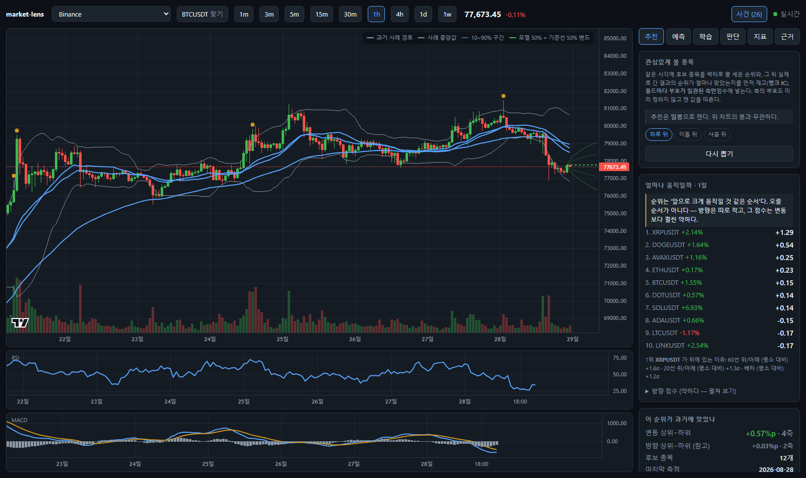
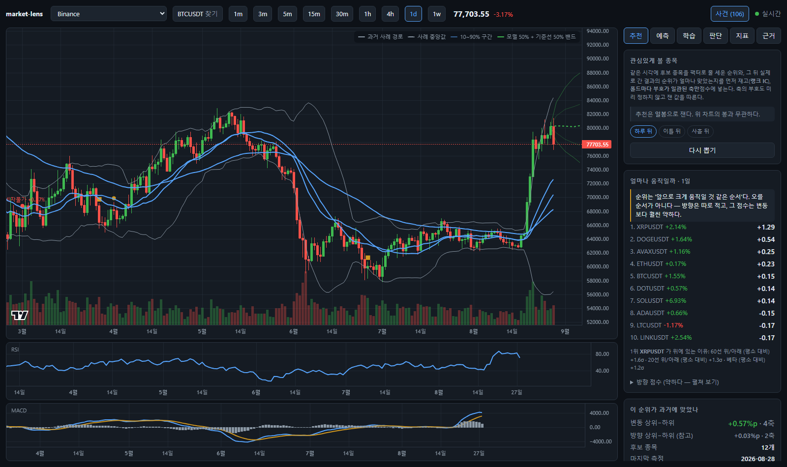

# market-lens

차트를 읽고, 지표로 분석하고, 이후 양상을 예측하는 도구. 암호화폐·미국주식·국내주식을
같은 화면에서 본다.



## 빠르게 띄우기

키가 없어도 바로 돈다 — 기본값인 Binance 는 인증이 필요 없다.
서버 두 개를 띄운다: API(8000)와 화면(5173). **창 두 개가 필요하다.**

처음 한 번:

```powershell
python -m venv .venv
.venv\Scripts\pip install -e ".[dev,ml]"
cd web
npm install
cd ..
```

띄울 때 — 첫 번째 창. **한 줄이다.** 뒤쪽 인자를 빼고 `python -m uvicorn` 까지만
치면 오류가 아니라 사용법(`Usage: python -m uvicorn [OPTIONS] APP`)이 출력된다:

```powershell
.venv\Scripts\python -m uvicorn marketlens.api.app:app --app-dir server --port 8000
```

`Uvicorn running on http://127.0.0.1:8000` 이 뜨면 **이 창은 그대로 둔다.** 서버가
살아 있어야 하고, 창을 닫으면 화면이 데이터를 못 받는다.

두 번째 창:

```powershell
cd web
npm run dev
```

그리고 http://localhost:5173 을 연다. 상단 탭에서 **추천** 을 누르면 오늘 볼 종목이 나온다.

> **Windows PowerShell 에서 `&&` 를 쓰지 말 것.** 5.1 은 `&&` 를 문 구분 기호로
> 안 받아 `'&&' 토큰은 이 버전에서 올바른 문 구분 기호가 아닙니다` 로 죽는다.
> 한 줄에 이어 쓰려면 `;` 를 쓴다 — `cd web; npm install; cd ..`.
> Linux·macOS·Git Bash 는 `&&` 가 그대로 되고, 경로 구분은 `.venv/bin/pip` 이다.

`.env.example` 를 `.env` 로 복사해 키를 넣으면 미국주식·국내주식이 켜진다. 키가 없는
프로바이더는 목록에 '비활성'으로 남고 앱은 정상 기동한다.

## 무엇이 들어 있나

**질문하면 앞으로의 경로를 차트에 그린다.**
"급락 나온 뒤 3일 동안 어떻게 움직였어?" 라고 물으면 — 과거에서 같은 조건이 있었던
자리를 찾아, 그때 실제로 간 경로를 지금 가격에 붙여 그린다. 개별 경로와 분위수 밴드를
같이 낸다: 경로만 보면 그럴듯한 한 줄에 눈이 가고, 밴드만 보면 무슨 일이 있었는지가 사라진다.

- **유사구간 검색** — 최근 궤적(z-정규화 + DTW)과 상황 벡터 28축(추세·모멘텀·위치·변동성·
  거래량·레짐·캘린더)으로 "지금과 비슷했던 때"를 찾는다
- **이벤트 스터디** — 사건 전후를 정렬해 초과수익률(AR)과 누적(CAR), t값, 방향 일치율.
  사건은 여섯 갈래에서 온다: 내장 사전 · 달력 계산(월말·분기말·만기) · 차트 탐지
  (급락·거래량 폭발·변동성 급등·신고점·갭) · GDELT 보도량 · FRED 매크로 · 직접 등록
- **질문 해석** — 자연어를 조건으로 옮기고(Claude, 키 없으면 규칙 파서), **해석을 화면에
  보여줘 사람이 고칠 수 있게** 한다. 조건을 못 맞춰 풀었으면 반드시 알린다
- **학습층** — 상황 28축 + 유사구간 요약 + 사건 이력을 입력으로 넣고 지평별 분위수를
  학습해 부채꼴을 그린다. 목표값은 ATR 단위(무차원)라 변동성 레짐이 바뀌어도 성립한다.
  기준선 둘(단순 · 변동성)과 견주고, **변동성 기준선을 못 넘으면 모델을 쓰지 않고
  그 사실을 화면에 쓴다**. 검증은 퍼징 워크포워드, 밴드는 컨포멀로 보정한다(적중률 80.0%)
- **근거 등록부** — 이 프로그램이 기대는 방법론 19건의 출처·효과·**한계**.
  기술적 분석처럼 논쟁적인 것은 '논쟁 중'으로 표시한다
- **지표 35종** — 일목균형표, 피셔 변환, 피보나치 되돌림, MACD, ADX/DMI, 슈퍼트렌드,
  파라볼릭 SAR, 볼린저·켈트너·돈치안, TTM 스퀴즈, RSI·스토캐스틱·CCI·MFI·TSI,
  OBV·VWAP·CMF·거래량 프로파일, 피벗 4종, 지지·저항 군집, 캔들 패턴 15종
- **시그널 엔진** — 14개 규칙의 가중 투표. 판단마다 근거 문장이 붙는다
- **예측 3층** — 규칙 / 통계적 구간(ATR·부트스트랩) / ML 방향성 분류
- **백테스트** — 확정봉 이벤트 기반, 수수료·슬리피지, 승률·PF·MDD·샤프
- **실시간** — 웹소켓 팬아웃. 브라우저 탭이 열 개여도 거래소 연결은 하나
- **종목 고르기** — 시장을 먼저 안 골라도 된다. "삼성" 을 치면 국내주식이, "BTC" 를
  치면 바이낸스·업비트가 같이 나온다. 전체 목록을 주는 시장(바이낸스 1,358 · 업비트 849 ·
  국내주식 4,303 · 미국주식 6,713)은 눌러서 훑을 수도 있다
- **종목 추천** — 오늘 관심있게 볼 종목을 1/2/3일 지평으로 줄 세운다. 순위를 만들기
  전에 그 순위가 과거에 맞았는지를 먼저 재고, 잰 것만 쓴다

**화면은 "얼마나 움직일까" 를 중심으로 짜여 있다.** 27,664판을 채점해 보니 80% 밴드는
82.2% 로 들어맞았고 방향은 55.0% 였다. 그래서 첫 탭이 추천(변동 순위)이고, 모든 카드가
폭을 위에 두고 방향은 "참고" 로 접어 둔다 — 지우지는 않는다. 쓸지 말지는 보는 사람이 정한다.
- **매일 스스로 학습** — 챔피언을 새 데이터로 다시 굽고, 설정을 하나만 흔든 도전자와
  겨뤄 **마진 이상 이길 때만** 갈아끼운다. 결과는 [docs/LEARNING.md](docs/LEARNING.md)
  에 매일 쌓인다 — 진 날도 그대로 남는다

## 데이터 소스

| 시장 | 실시간 | 과거 캔들 | 키 |
|---|---|---|---|
| 암호화폐 | Binance kline WS · Upbit trade WS | Binance `/klines` · Upbit `/candles` | 불필요 |
| 미국주식 | Finnhub trade WS | 야후 chart API (분봉~주봉) | Finnhub 무료 가입 |
| 전 세계 (야후) | 없음 | 야후 chart API. `005930.KS` · `^GSPC` · `BTC-USD` | **불필요** |
| 국내·미국 (토스) | 토스 `trade:kr`·`trade:us` WS | 토스 `/api/v1/candles` (1분·일봉) | 토스증권 계좌 + Open API 키 · **연결 확인됨** |
| 국내주식 | KIS `H0STCNT0` | KIS 일봉 TR + 분봉 TR | 증권계좌 + 앱키 |
| 사건 | — | GDELT 보도량 · FRED 매크로 | **불필요** |

- 미국주식은 **히스토리와 실시간의 출처가 다르다** — Finnhub 무료 티어가 과거 캔들을
  403 으로 막기 때문이다. 그 이음매는 `providers/composite.py` 한 곳에만 있다.
- 원래 히스토리를 Stooq 로 받았는데 2026년에 봇 차단이 걸려 야후로 바꿨다. 야후도
  공식 API 가 아니라 언젠가 같은 일이 난다 — 그래서 파일 하나만 갈면 되게 짜 뒀다.
- **국내주식은 증권계좌 없이도 과거 차트를 볼 수 있다** — 야후에서 `005930.KS`.
  실시간 체결은 KIS 키가 있어야 한다.
- GDELT 는 키가 필요 없지만 응답이 느리고 막히는 망이 있다. 기본 소스에서 빠져 있고,
  켜면 실패해도 나머지 소스로 계속 돈다. 관심도 축은 위키백과 조회수로 대신한다.
- **토스증권 키 하나로 국내와 미국을 다 본다.** OAuth2 client_credentials 한 번이면
  되고, 과거 캔들과 실시간 체결이 같은 키로 열린다 — KIS 보다 훨씬 단순하다.
  다만 캔들 단위가 1분·일봉뿐이라 그 사이 봉은 야후 쪽이 낫다.

## 설계 규칙

이 프로젝트를 고칠 때 지켜야 하는 것들은 [CLAUDE.md](CLAUDE.md) 에 있다. 요약하면:

1. 공식은 코드가 아니라 데이터다 — 지표 목록은 `indicators/catalog.py` 한 벌
2. 캔들 스키마도 한 벌 — 거래소별 차이는 프로바이더 안에서 끝난다
3. 미확정 봉으로 시그널을 확정하지 않는다 (리페인팅)
4. 지표 계산은 서버에서만
5. 프로바이더는 `history` / `stream` 두 메서드뿐
6. 예측 3층은 출력 형태가 같다

## 검증

```bash
.venv/Scripts/python -m pytest server/tests -q      # 333개
cd web; npx tsc -b                                # 타입체크
cd web; npm run shot                              # 실제 화면 PNG (서버 2개가 떠 있어야 함)

.venv/Scripts/python scripts/sweep.py               # 학습 기법 실험
.venv/Scripts/python scripts/asof.py --tf 1d        # 그날 서서 예측하고 실제와 맞춰 보기
.venv/Scripts/python scripts/daily.py --budget 2 --dry-run   # 자동 학습 한 바퀴 (승격 없이)
.venv/Scripts/python scripts/screen.py --dry-run     # 추천 팩터가 실제로 맞는지 재기
.venv/Scripts/python scripts/study.py --hours 0.1    # 예측→채점→분석→기권규칙 한 바퀴
```

**as-of 검증 결과** (일봉 10봉 지평, origin 40개/종목):

| 종목 | 방향적중 | 경로상관 | 오차% (학습 / 기준선) |
|---|---|---|---|
| ^GSPC | 80.0% | +0.384 | 1.40% / 1.71% |
| AAPL | 72.2% | +0.311 | 2.92% / 2.79% |
| BTCUSDT | 54.1% | +0.016 | 4.64% / 4.97% |
| ETHUSDT | 51.4% | +0.016 | 6.77% / 6.75% |

**주식·지수는 맞고 암호화폐는 거의 동전던지기다.** 표본이 종목당 35~40개라
소수점까지 믿을 숫자는 아니다.

`screenshots/` 의 PNG 를 눈으로 확인할 것. 일목 구름이 마지막 봉보다 26봉 앞까지
뻗는지, 원화 위의 글자가 읽히는지는 테스트로 안 잡힌다.

## 관심있게 볼 종목 (1/2/3일)



같은 시각에 후보 종목을 팩터로 줄 세운 순위와, 그 뒤 실제로 간 결과의 순위가 얼마나
맞았는지를 **먼저 재고**(랭크 IC), 폴드마다 부호가 일관된 축만 점수에 넣는다. 축의
부호도 미리 정하지 않고 잰 값을 따른다. 안 잰 지평은 순위를 만들지 않는다.

**두 점수를 따로 낸다.** 섞으면 "크게 움직인다"가 "오른다"로 읽힌다.

| | 뜻 | 실제 성적 |
|---|---|---|
| **변동** | 앞으로 크게 움직일까 | 잘 된다 |
| **방향** | 어느 쪽으로 갈까 | 훨씬 약하다 |

**상위−하위** (점수 상위 묶음 평균 − 하위 묶음 평균, 수수료 전. 3천 일봉 × 12종목):

| | 암호화폐 변동 | 암호화폐 방향 | 미국주식 변동 | 미국주식 방향 |
|---|---|---|---|---|
| 1일 | +0.57%p | +0.03%p | +0.15%p | +0.05%p |
| 2일 | +0.75%p | +0.32%p | +0.15%p | +0.14%p |
| 3일 | +0.94%p | +0.65%p | +0.21%p | +0.12%p |

**1일 방향은 사실상 0이다.** 3일로 갈수록 나아지지만 3일 방향 +0.65%p 도 수수료를
빼기 전 숫자다. 변동 쪽은 어느 지평에서나 일관되게 갈린다.

### 왜 '평소 대비'로만 점수를 내는가

원값 축(변동성·베타·밴드폭)은 IC 가 3~10배 크게 나온다(+0.33 대 +0.08). 그런데 그건
**"DOGE 는 원래 BTC 보다 많이 움직인다"** 는 고정 순위다. 늘 맞지만 매일 같은 답을
내므로 "오늘 뭘 볼까"에는 쓸모가 없다. 그래서 점수는 **자기 과거와 견준 축**으로만
만들고, 측정은 전부/원값만/평소대비만 셋을 다 재서 남긴다 — 나눠 보지 않으면 그냥
변동성 순위를 추천이라고 부르게 된다.

## 못 맞히는 자리에서는 말을 안 한다

먼저 예측하고, 지평이 지난 뒤 맞았는지 보고, **맞은 판과 틀린 판을 조건별로 갈라** 본다.
갈라진 조건은 "이 조건이면 말을 안 한다"는 기권 규칙이 되고, 규칙은 **한 번도 안 본
구간**에서 확인한 것만 쓴다. 결과는 [docs/STUDY.md](docs/STUDY.md) 에 쌓인다.

짧은 지평의 방향 예측은 문헌에서도 잡음에 가깝다. 그런 판에서 정확도를 올리는 확실한
길은 더 잘 맞히는 것이 아니라 **못 맞히는 자리에서 안 맞히는 것**이다. 기권한 판은
방향을 말하지 않고 밴드만 남긴다 — 밴드는 방향과 달리 실제로 잘 맞는다(적중 78~80%).

가설 수와 최종 구간을 열어 본 횟수를 화면에 같이 적는다. 수백 개를 세우면 그중 하나는
반드시 이기고, 최종 구간도 볼 때마다 조금씩 닳는다.

**8시간 · 27,664판을 돌린 결과**(2026-08-28):

| | 값 |
|---|---|
| 방향 적중 | 55.0% (20,305판) |
| 80% 밴드 적중 | 82.2% |

가장 크게 갈린 것은 **모델 자신의 확신도**였다 — 예측 이동폭이 클 때 64.7%,
거의 안 움직인다고 할 때 47.5%로 **17%p** 가 벌어진다. 거래량이 터진 날은 오히려 46.5%다.

**쓸 만한 기권 규칙은 못 찾았다.** 최종 구간까지 살아남은 최선이 +0.5%p 였고,
가설을 수천 개 세운 끝의 +0.5%p 는 개선이 아니라 잡음이다. 그래서 쓰지 않는다 —
자세한 이유는 [docs/STUDY.md](docs/STUDY.md).

## 매일 스스로 학습

매일 한 번, 사람이 시키지 않아도 스스로 학습하고 더 나은 설정을 찾는다.

```
챔피언을 새 데이터로 재학습 → 설정을 하나만 흔든 도전자도 학습
→ 같은 검증으로 재고 → +0.002 이상 이길 때만 갈아끼운다
```

- **GitHub Actions** — 매일 05:00 KST. `learning/` 과 `docs/LEARNING.md` 만 커밋한다
- **내 PC** — 매일 06:00 (작업 스케줄러 `market-lens-daily`). 여기는 토스 키가 있어
  국내주식까지 학습한다 (Actions 는 IP 제한으로 못 한다)

자동 탐색은 놔두면 과최적화 기계가 된다. 그래서 세 가지를 박아 뒀다:
**승격에 마진을 두고**(없으면 잡음으로 매일 모델이 바뀐다), **시험 횟수를 기록에 남기고**
(같은 데이터로 수백 번 시험하면 그중 하나는 반드시 이긴다), **승격 판정은 퍼징
워크포워드로만 한다**(as-of 는 따로 재서 기록만 한다 — 승격 기준에 넣으면 그것도
학습 구간이 된다).

## 아직 없는 것 · 한계

- 자동매매·주문 (범위 밖. KIS 는 시세 조회 TR 만 쓴다)
- 구름대의 면적 채우기 — lightweight-charts v4 는 두 선 사이를 칠하지 못해
  선 두 개로 그린다
- 학습층은 `pip install -e ".[ml]"` 로 scikit-learn 을 깔아야 켜진다
- **학습이 되는 자리는 봉과 지평이 정한다** — 시간봉 3~12봉, 일봉 5~20봉.
  시간봉은 **표본이 커야 한다**(12종목 × 1.2만봉). 6종목 4천봉에서는 같은 코드가
  −0.11 이었다. `scripts/sweep.py` 로 직접 재 볼 수 있다
- **알파(시장 대비 초과수익)는 가격보다 세 배 잘 예측된다**(+0.030 vs +0.010).
  다만 가격 밴드로 바꾸려면 예측 불가한 시장 성분을 도로 더해야 해서 이득이 사라진다
- **학습이 늘 이기지는 않는다.** BTC 1시간봉·1일봉과 ETH 4시간봉에서 재 보면 학습 모델이
  변동성 기준선을 못 넘는다(skill −0.04 ~ −0.11). 짧은 지평의 방향 예측은 원래 잡음에
  가깝다는 문헌과 맞는 결과다. 도구는 그럴 때 기준선을 쓰고 그렇게 말한다 —
  숫자를 좋게 보이려고 기준선을 약하게 바꾸지 않았다
- 야후 분봉 히스토리에 상한이 있다 — 1분봉 7일, 5~30분봉 60일, 1시간봉 2년
- GDELT DOC API 는 기본이 최근 3개월이고, 보도량은 '중요도'가 아니라 '언론의 관심'이다
- **예측은 과거의 반복을 가정한다.** 처음 보는 상황(레짐 전환, 새로운 규제)에서는
  비슷한 과거가 없고, 그때가 바로 예측이 제일 필요한 때다. 화면이 사례 수와
  밴드 적중률을 같이 보여주는 이유다

## 라이선스와 출처

차트는 [lightweight-charts](https://github.com/tradingview/lightweight-charts) (Apache-2.0,
TradingView). 지표 원전은 각 스펙의 `source` 필드에 적혀 있고 `/api/indicators` 로 나간다.

**투자 판단에 쓰지 말 것.** 여기 나오는 예측은 과거 가격의 통계일 뿐이다.
